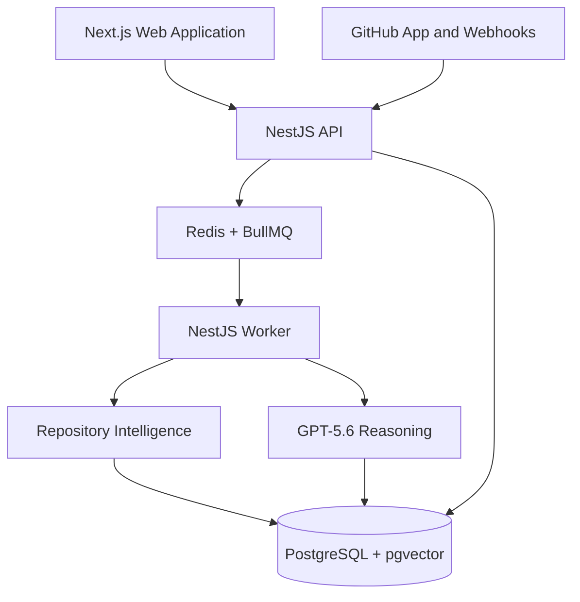

# Atlas Build Specification

**Status:** Engineering constitution  
**Authority:** `ATLAS_GENESIS.md` is the product constitution. `docs/00-product-strategy.md` is the business and adoption strategy. This specification defines how Atlas is built. When implementation convenience conflicts with this document, this document wins; when this document conflicts with Genesis, Genesis wins.

## 1. Vision

Atlas is the AI Engineering Operating System. Its software must make engineering understanding durable, evidence-backed, temporal, and useful at the point of change. The system is not a collection of AI features. It is a coherent platform whose capabilities create and maintain the Atlas Memory Graph (AMG), reason over it, and present trustworthy engineering context.

Every implementation decision must preserve five outcomes: provenance for material claims; explicit confidence and uncertainty; tenant isolation; human accountability; and incremental, observable operation. Atlas should feel deliberate and calm. It must never trade away explainability for a superficially impressive answer.

## 2. Architecture

Atlas is a TypeScript monorepo with a web application, a modular backend API, asynchronous workers, and shared packages. The architecture is a modular monolith at V1: independently deployable processes may exist for web, API, and worker workloads, but domain boundaries are enforced in code rather than prematurely split into microservices.



The API owns synchronous user-facing commands and query composition. Workers own long-running ingestion, parsing, graph projection, indexing, and reasoning jobs. PostgreSQL is the authoritative persistence layer; Redis is ephemeral coordination and queue infrastructure. No user-visible state may exist solely in Redis. Every asynchronous job is idempotent and traceable to a tenant, source event, and correlation identifier.

### Capability architecture

Atlas is organized around six product capabilities. A capability owns its domain behavior, persistence access, jobs, API use cases, and tests. Capabilities may depend on contracts exposed by another capability, never its private persistence model or internal services.

| Capability | Responsibility | Owns | Must not own |
|---|---|---|---|
| Repository Intelligence | Acquisition and deterministic understanding of repositories | GitHub connection, snapshots, parsing, extraction, metadata | AI conclusions or user-facing health policy |
| Atlas Memory Graph | Versioned engineering topology | entities, relationships, graph projections, traversal | raw connector logic or UI state |
| Engineering Memory | Durable knowledge lifecycle | evidence, confidence, provenance, timelines, corrections | code parsing or model-provider transport |
| Continuous Reasoning | Bounded AI analysis and planning | context assembly, agents, evaluations, insight proposals | ungrounded persistent facts |
| Repository Pulse | Explainable engineering condition | dimension calculations, trends, health policy | hidden scoring or person ranking |
| Engineering Experience | Human interaction with Atlas | dashboard, graph explorer, chat, insight feed | business rules duplicated from API |

Cross-capability communication uses application services and typed domain events. The backend may use in-process event dispatch initially, with an outbox table for durable publication. Event names are past tense (`repository.snapshot.created`, `memory.correction.recorded`) and payloads contain stable IDs, tenant ID, event version, occurred-at timestamp, and correlation ID.

## 3. Repository Structure

Use pnpm workspaces, Turborepo, TypeScript project references, ESLint, Prettier, and a single root toolchain. Do not create a generic `common` dumping ground. Shared code must have a named purpose.

```text
atlas/
  apps/
    web/                         # Next.js App Router application
    api/                         # NestJS HTTP/WebSocket API
    worker/                      # NestJS BullMQ processors and schedulers
  packages/
    contracts/                   # Versioned API DTOs, event contracts, schemas
    domain/                      # Capability domain types, invariants, ports
    database/                    # Prisma schema, migrations, database client
    config/                      # Validated environment and shared configuration
    ui/                          # Design-system components and tokens
    sdk/                         # Typed API client for web and integrations
    testing/                     # Test factories, fixtures, integration helpers
  docs/
  infrastructure/
    docker/
    compose/
  .github/workflows/
  ATLAS_GENESIS.md
  ATLAS_BUILD_SPEC.md
  package.json
  pnpm-workspace.yaml
  turbo.json
```

Within API and worker applications, organize code by capability first:

```text
src/capabilities/<capability>/
  application/                   # use cases, commands, queries, ports
  domain/                        # entities, value objects, invariants, events
  infrastructure/                # repositories, providers, queue adapters
  presentation/                  # controllers, DTO mapping, resolvers
  tests/
```

Avoid a global `services/`, `utils/`, `helpers/`, `models/`, or `components/` folder. A file belongs with the capability it serves. Cross-capability code belongs in a deliberately named shared package only when it is genuinely reusable and dependency-safe.

## 4. Technology Stack

| Concern | Required choice | Rule |
|---|---|---|
| Language | TypeScript, strict mode | No `any`; validate external data at boundaries |
| Web | Next.js current stable, App Router, React | Server Components by default; client components only for interaction |
| API | NestJS current stable | REST JSON for V1; OpenAPI generated from validated DTOs |
| Persistence | PostgreSQL current stable + pgvector | PostgreSQL is the source of truth |
| ORM | Prisma | Migrations are committed and reviewed |
| Queue | Redis + BullMQ | Jobs are idempotent, retried with policy, and observable |
| Validation | Zod | Validate all external inputs, events, and AI structured outputs |
| Authentication | Auth.js in web plus NestJS JWT/session validation | Organization-scoped authorization everywhere |
| Styling | Tailwind CSS + Radix primitives + internal UI package | No uncontrolled one-off visual systems |
| Testing | Vitest, Testing Library, Playwright | Test behavior through public contracts |
| Observability | OpenTelemetry, structured JSON logs | Correlation IDs required across request and job boundaries |
| Local runtime | Docker Compose | One command starts dependencies and apps |

Pin major versions in the lockfile. Use only actively maintained dependencies. Any new dependency needs a clear purpose, license compatibility, security posture, and removal cost. Do not introduce a graph database at V1: AMG is modeled in PostgreSQL with typed entity and relationship tables, recursive traversal where appropriate, materialized projections for hot queries, and pgvector only for retrieval support.

## 5. Coding Standards

TypeScript compiler options must include `strict`, `noUncheckedIndexedAccess`, `exactOptionalPropertyTypes`, and `noImplicitOverride`. Use `type` for data shapes and `interface` only for extensible object contracts. Prefer immutable values, pure transformations, explicit return types on exported functions, and discriminated unions for state machines.

Names express domain intent. Use `camelCase` for variables and functions, `PascalCase` for types/classes/components, `kebab-case` for filenames and routes, and plural database table names. Boolean names begin with `is`, `has`, `can`, or `should`. Never use ambiguous names such as `data`, `info`, `thing`, `manager`, `helper`, `util`, or `handle` unless the scope makes them precise.

Functions do one thing. Controllers map transport input to application commands and responses; they do not contain business rules. Repositories persist and retrieve; they do not calculate policy. React components render and interact; they do not make direct database calls or duplicate API business logic. Do not use comments to compensate for unclear code; use comments for non-obvious invariants, security constraints, or rationale.

Use dependency injection at application boundaries. Domain code must not import NestJS, Prisma, React, BullMQ, or a model-provider SDK. Adapters implement ports defined by the domain or application layer. This keeps core rules testable and prevents vendor coupling from leaking into product semantics.

## 6. Domain Model

All persisted domain records are tenant-scoped and use UUID primary keys, `createdAt`, `updatedAt`, and optimistic-concurrency or version fields where concurrent modification matters. Do not use soft deletes for engineering truth. Use explicit lifecycle states and temporal validity instead.

### Core records

| Aggregate | Purpose | Required invariants |
|---|---|---|
| Organization | Tenant and policy boundary | All child records belong to exactly one organization |
| Repository | Connected source repository | Has provider identity, default branch, connection status |
| RepositorySnapshot | Immutable source revision | References commit SHA and acquisition provenance; never mutated |
| GraphEntity | Stable engineering object | Has type, canonical key, source scope, and lifecycle |
| GraphRelationship | Typed edge between entities | Has provenance, confidence, valid time range, and status |
| MemoryRecord | Fact, decision, or recommendation | Has classification, lifecycle, owner where applicable, and evidence |
| EvidenceItem | Immutable support or counterevidence | Identifies source, locator, revision/time, extraction method |
| Correction | Amendment to a graph or memory claim | Never overwrites prior claim; records actor, rationale, and target |
| Insight | Actionable engineering conclusion | Has evidence, confidence, impact, status, and reevaluation trigger |
| PulseAssessment | Versioned condition measurement | Stores dimensions, calculation version, evidence set, and confidence |

Memory lifecycle states are `proposed`, `verified`, `active`, `challenged`, `superseded`, `deprecated`, and `archived`. Insight states are `open`, `acknowledged`, `resolved`, `dismissed`, and `expired`. Transitions are explicit application commands and emit audit events. A correction changes the status of the old claim and creates a new linked claim; it never alters provenance in place.

### Engineering Confidence

Every Atlas insight must expose three independent attributes: **Evidence, Confidence, and Impact**. This is the minimum trust contract. Insights without all three are not eligible for user-facing display.

| Attribute | Meaning | Implementation rule |
|---|---|---|
| Evidence | Specific artifacts supporting or challenging the claim | At least one immutable `EvidenceItem`; UI links to source and locator |
| Confidence | Atlas’s confidence that the claim is correct | Integer 0–100 plus method, factors, and uncertainty explanation |
| Impact | Consequence if the claim is true and unaddressed | `low`, `medium`, `high`, or `critical`; separate from confidence |

Confidence is not a model probability presented as certainty. It is a calibrated assessment composed from evidence quality, source agreement, extraction determinism, freshness, coverage, and contradiction penalties. The stored record includes `confidenceScore`, `confidenceBand`, `confidenceMethod`, `confidenceFactors`, `missingEvidence`, and `counterevidence`.

Use bands: `high` is 85–100, `moderate` is 60–84, `low` is below 60. V1 may display a percentage only when a deterministic or calibrated rule produces it; otherwise display the band and explanation. Low-confidence insights remain discoverable but must not generate default notifications. Critical impact does not raise confidence, and high confidence does not raise impact.

Example: Documentation Drift can be 97% confidence and Medium impact because a README is 142 days behind its latest review, OpenAPI changed 11 commits ago, and an endpoint signature differs. The UI must show those artifacts, calculation factors, and the difference between “documentation is likely stale” and “this change will cause an incident.”

## 7. UI Standards

The Engineering Experience is an evidence-first application. The primary route is `/org/[organizationSlug]/repositories/[repositoryId]/pulse`; the first screen is Repository Pulse, not chat. The UI supports dashboard, repository onboarding, Pulse details, graph explorer, insight feed, evidence drawer, and bounded conversational analysis.

Use a restrained professional visual system: clear hierarchy, high information density without clutter, neutral surfaces, one semantic color system, and readable typography. Color never conveys meaning alone. Statuses require text and icons. Use `low`, `medium`, `high`, and `critical` consistently across the product; do not invent synonyms per screen.

Every insight card and detail page must show: claim; impact; confidence; evidence count; affected scope; created/updated time; status; recommended action; and an evidence affordance. Evidence opens a side panel with source type, source locator, relevant excerpt or metadata, timestamp or commit, and relationship to the claim. No opaque “AI says” labels.

Pulse must show its dimensions separately: overall health, architecture, documentation drift, deployment risk, knowledge coverage, ownership, and AI confidence. Scores are explainable, trendable, and navigable to their factors. Never rank individual contributors, gamify health, or hide low assessment confidence behind a favorable overall score.

Use URL-addressable state for organization, repository, entity, insight, and time scope. Support loading, empty, error, permission-denied, and stale-data states deliberately. Skeletons must match final layouts. Destructive actions require clear labels and confirmation; corrections must preview the exact claim they amend.

## 8. API Standards

Expose versioned REST endpoints under `/v1`. Route names are nouns and reflect resources, for example `GET /v1/repositories/:repositoryId/pulse` and `POST /v1/insights/:insightId/corrections`. Use plural collections, stable UUID identifiers, ISO 8601 timestamps, camelCase JSON, and RFC 7807-style problem responses.

All write endpoints require authentication, organization membership, role authorization, audit capture, and idempotency keys where retries could duplicate effects. Authorization is checked from the server-derived organization context; never trust a client-provided organization ID alone. Responses use explicit DTOs, never raw ORM models.

Pagination uses cursor-based pagination with stable ordering. Queries accept explicit filters and bounded time ranges. Expensive graph traversals have maximum depth, node count, and query-time limits. Long-running commands return `202 Accepted` with an operation resource; clients poll or subscribe to status. Webhook receivers verify signatures, persist a receipt before enqueueing, and acknowledge rapidly.

OpenAPI is generated and checked into CI for breaking-change detection. Contract schemas live in `packages/contracts` and are validated at API, queue, webhook, and AI boundaries.

## 9. Database Standards

PostgreSQL schema changes are Prisma migrations only. Every migration is forward-only, reviewed, reversible by a new migration, and tested against a representative database. No application startup migration in production. Production queries require indexes justified by access patterns; `EXPLAIN ANALYZE` is required for new high-volume or graph traversal queries.

Use `organization_id` on every tenant-owned table and composite indexes beginning with it for tenant-scoped access. Repository snapshots, evidence items, graph relationships, memory records, insights, and audit events are append-oriented. Use transactions for multi-record invariants such as correction creation or graph projection application. Store provider payloads minimally and with retention controls; never put raw secrets, tokens, or unbounded source archives in relational JSON columns.

Vectors are supplemental retrieval indexes, never substitutes for typed relationships or authorization filters. Similarity search always filters by organization and visibility policy before returning context. Store vector model/version and source chunk provenance.

## 10. AI Standards

GPT-5.6 is a bounded reasoning component, not a data source. Models receive an explicit task, tenant-scoped evidence package, graph paths, time scope, applicable policy, and required Zod-validated output schema. The system prompt and model version are recorded for every persisted AI conclusion, subject to configured retention policy.

The Continuous Reasoning capability implements Architect, Historian, Reviewer, Planner, Librarian, Forecaster, and Orchestrator roles as explicit application services. They share contracts and durable memory; no agent has an untracked private state. The Orchestrator selects the smallest relevant agent set, validates citations, and may request a challenge analysis for high-impact or contradictory outcomes.

AI outputs may propose claims and insights. They cannot create verified facts, modify ownership, change policies, write to customer repositories, merge pull requests, or trigger external actions without a separately authorized human workflow. The model must not infer a source it was not shown. Every output distinguishes observed facts, inferences, recommendations, assumptions, and missing evidence.

Maintain evaluation fixtures for each V1 insight type. Track citation precision, unsupported-claim rate, evidence coverage, correction rate, false-positive rate, actionability, and latency. Prompt changes, model changes, and confidence-calculation changes require regression evaluation before release.

## 11. Engineering Standards

Use explicit configuration schemas. Local, test, staging, and production environments must differ only through validated configuration and infrastructure—not forks of application code. Secrets are injected through environment or a managed secret provider, never committed, logged, returned by APIs, or included in test fixtures.

Every request, webhook, job, extraction run, and reasoning run has a correlation ID propagated through logs, traces, database records where useful, and error responses. Logs are structured JSON with event names and safe metadata. Errors are actionable, categorized, and never expose secrets, source content beyond permission, or internal stack details to end users.

Feature flags are organization-scoped, server-evaluated, and have owners and expiry dates. Do not use flags to leave two permanent implementations in production. Background jobs define retry policy, backoff, timeout, dead-letter behavior, idempotency key, and observability before they are introduced.

## 12. Security Standards

Least privilege is mandatory. V1 GitHub access is read-only except explicitly approved, auditable future integrations. Encrypt in transit and at rest. Apply organization-scoped authorization in API queries, graph traversal, vector retrieval, jobs, cache keys, and logs. Tenant isolation is tested as a security property, not assumed from UI routing.

Validate and sanitize all untrusted input. Treat repository content, documentation, webhooks, issue text, and model outputs as untrusted. Repository text may contain prompt injection; it is evidence, never instruction. The reasoning pipeline must delimit source content, prohibit it from changing system policy, and prefer structured extraction. Verify GitHub webhook signatures and use replay protection.

Implement audit logs for authentication, integration grants, data exports, policy changes, corrections, insight dispositions, and every external write. Redact tokens, credentials, personal data, and sensitive source fragments from logs. Authorization decisions must be default-deny.

## 13. Testing Standards

Testing follows the behavior and risk of a change. Unit tests cover domain invariants, confidence calculations, parsing transforms, and pure functions. Integration tests cover database repositories, migrations, queue handlers, webhook verification, and API use cases against real PostgreSQL and Redis containers. Contract tests validate GitHub payloads and public API schemas. Playwright covers critical user journeys: onboarding, Repository Pulse, evidence inspection, correction, graph traversal, and permission denial.

No test may mock the unit under test. Mock external network and model-provider boundaries only. Use fixtures that represent real engineering artifacts and edge cases: renamed files, deleted environments, ambiguous ownership, stale documents, contradictory evidence, duplicate webhook delivery, and replayed jobs. AI evaluation tests are deterministic where possible and use recorded, de-identified evidence packages.

CI blocks merges on typecheck, lint, format check, unit tests, integration tests, contract checks, migration validation, and critical E2E tests. Coverage is a signal, not a target; new code must test meaningful branches and failure behavior. Every bug fix adds a regression test unless infeasible, in which case the exception is documented in the pull request.

## 14. Performance Standards

V1 targets are service-level objectives, not guarantees in local development. API reads that do not invoke new reasoning should have p95 server latency below 500 ms. Repository Pulse and insight-list queries should meet p95 below 1.5 seconds for supported V1 repository sizes. Initial indexing may be asynchronous, but its progress must be visible and resumable. Webhook acknowledgment target is below 2 seconds.

Graph traversal is bounded and paginated. Retrieval context is budgeted by token and evidence relevance. Parsing and AI work runs off the request path. Cache only tenant-safe, invalidatable read models; cache keys include organization ID and relevant source version. Profile before optimizing, measure before caching, and protect the system with rate limits, concurrency limits, timeouts, and backpressure.

## 15. Accessibility Standards

Meet WCAG 2.2 AA for all user-facing flows. Use semantic HTML, keyboard navigation, visible focus, skip links, correctly associated labels, sufficient contrast, non-color status cues, and accessible names for interactive controls. Dialogs trap focus and return it on close. Graph visualizations require a keyboard-accessible list or table alternative that exposes the same entities, relationships, and actions.

Charts and Pulse scores require text summaries. Loading and asynchronous job states use appropriate live-region announcements without excessive interruption. Test accessibility automatically with axe and manually for critical flows.

## 16. Documentation Standards

Documentation is part of the product. Every capability has a `README.md` describing responsibility, public contracts, invariants, data ownership, events, and local test commands. Every non-trivial architecture decision creates an ADR in `docs/adr/` using `NNNN-title.md`, with context, decision, alternatives, consequences, owner, and review date.

Public API changes update OpenAPI, examples, and migration guidance. Operational changes update runbooks. AI prompt, model, evaluation, and confidence-method changes update their relevant technical documentation. Documentation must state what is observed, inferred, planned, or unsupported; it must not overstate implementation status.

## 17. Git Workflow

Use short-lived branches named `feat/`, `fix/`, `chore/`, `docs/`, or `refactor/` followed by a concise kebab-case description. Main is protected and always releasable. Changes enter main through reviewed pull requests with passing CI. Commit messages use Conventional Commits: `feat(scope): description`, `fix(scope): description`, and so on.

Each pull request includes purpose, capability affected, evidence of tests, migration or operational implications, documentation impact, and screenshots for UI changes. Reviewers assess domain boundaries, tenant safety, evidence/confidence/impact compliance, failure modes, and test sufficiency—not only style. Squash merge unless preserving commits materially aids history.

## 18. Definition of Done

A change is complete only when all applicable conditions are true:

- It maps to a named Atlas capability and respects its ownership boundary.
- Domain invariants and failure modes are explicit and tested.
- Input, event, and AI-output schemas are validated.
- Tenant authorization, audit behavior, and sensitive-data handling are correct.
- Persisted changes have reviewed migrations, indexes, and rollback strategy.
- Async work is idempotent, observable, bounded, and retry-safe.
- User-facing insights include evidence, confidence, and impact; Pulse values are explainable.
- UI includes loading, empty, error, permission, and accessibility states.
- Relevant unit, integration, contract, E2E, and AI evaluation tests pass in CI.
- Logs, metrics, traces, and correlation IDs make the behavior diagnosable.
- Documentation, OpenAPI, ADRs, and runbooks are updated where required.
- The change contains no placeholders, fake production integrations, silent fallbacks, or unexplained scope expansion.

Atlas is not done when code exists. It is done when an engineer can understand what changed, why it is safe, what evidence supports it, how it fails, and how it will remain correct as the system evolves.

## 19. Engineering Principles

The following principles are immutable review standards. A local optimization does not justify violating them without an ADR that names the exception, its owner, and review date.

1. Prefer determinism over cleverness.
2. Favor explicit contracts over implicit behavior.
3. Every abstraction must earn its existence through a concrete use case.
4. Optimize for readability and correct behavior before performance; measure before optimizing.
5. Remove complexity instead of hiding it behind indirection.
6. Make invalid states unrepresentable where practical.
7. Preserve evidence and history; do not overwrite engineering truth.
8. Keep side effects at boundaries and make them observable.
9. Design for replay, partial failure, and recovery from the first implementation.
10. Treat every external input, including AI output and repository text, as untrusted.
11. Make data ownership, authority, and lifecycle explicit.
12. Prefer small composable modules over framework-driven global state.
13. Build systems that explain themselves through types, logs, metrics, tests, and documentation.
14. Minimize privilege, data retention, and operational blast radius.
15. A user-facing conclusion must expose evidence, confidence, impact, and uncertainty.
16. Automate repetition, not accountability.
17. Backward compatibility is intentional work, never an accidental property.
18. Every dependency, migration, and feature flag must have an owner and removal plan.

## 20. Architectural Decision Governance

ADRs are governed engineering memory. An ADR is mandatory for a decision that changes a capability boundary, persistence model, public API contract, tenancy or security posture, model/provider policy, material dependency, deployment architecture, or operational SLO. “No ADR” is also a decision only when the change is demonstrably local and reversible.

ADRs live in `docs/adr/NNNN-title.md`. Each records status (`proposed`, `accepted`, `superseded`, `deprecated`), decision owner, reviewers, decision date, review date, context, options, decision, consequences, implementation references, capability impact, compliance checks, and supersession links. The decision owner remains accountable until the ADR is superseded or deprecated; transferring ownership requires an explicit update.

| Governance activity | Requirement |
|---|---|
| Review cadence | Proposed ADRs require review before implementation; accepted ADRs are reviewed at least every 12 months and after material incidents or scope changes |
| Supersession | A replacement ADR must link the superseded ADR, state what remains valid, and define a migration or retirement plan |
| Deprecation | Deprecated decisions retain history, owner, effective date, and removal deadline; deprecation never deletes the record |
| Compliance | Every implementing PR links the ADR; the Architect capability records implementation evidence and exceptions |
| Audit | Quarterly architecture audit reviews overdue ADRs, open exceptions, expired decisions, and unresolved drift findings |

Architecture compliance is evidence-backed. Atlas must model `constrained_by`, `implements`, `violates`, and `supersedes` relationships between ADRs and relevant entities. A detected deviation is an insight, not proof of wrongdoing: it must show the decision, implementation evidence, confidence, impact, and an owner review path.

## 21. Capability Contracts

Every capability has a versioned contract in `docs/capabilities/<capability>.md`, reviewed with material changes. The contract is the boundary reference for code, events, APIs, operational expectations, and tests.

Each capability contract must declare:

| Required declaration | Meaning |
|---|---|
| Responsibilities | Outcomes it owns and explicit non-responsibilities |
| Data owned | Tables, aggregates, retention, and write authority |
| Public interfaces | API endpoints, commands, queries, UI contracts, and ports |
| Events consumed | Event name, version, ordering/idempotency assumptions, failure handling |
| Events published | Event name, schema, producer guarantees, and consumers known at publication |
| Invariants | Rules that must hold before and after every state transition |
| Dependencies | Capability, external service, reason, failure posture, and removal strategy |
| SLAs/SLOs | Latency, freshness, availability, and correctness expectations |
| Security classification | Data sensitivity, authorization rules, audit requirements |
| Test obligations | Contract, integration, and failure-mode tests required |

No capability may directly write another capability’s owned tables. Cross-capability behavior uses public application contracts or durable events. Breaking changes require semantic versioning of the relevant contract, consumer impact analysis, migration guidance, and an ADR where material.

## 22. Repository Pulse Specification

Repository Pulse is a formally specified capability, not a decorative score. It calculates a versioned, explainable assessment of a repository’s engineering condition. It is a decision-support signal; it must not be used for individual performance evaluation, compensation, or ranking.

### Scoring philosophy

Each dimension is calculated from documented, tenant-scoped evidence rules and stored with its formula version, input set, calculation time, confidence, missing evidence, and exclusions. Scores describe evidence-backed condition, not objective code quality. A score is withheld rather than fabricated when coverage is insufficient.

The V1 overall health score is a weighted sum of normalized dimension scores:

```text
Overall Health =
  Architecture Integrity × 25% +
  Knowledge Coverage × 20% +
  Ownership Coverage × 15% +
  Documentation Freshness × 15% +
  Deployment Stability × 15% +
  Testing Confidence × 10%
```

The overall score is displayed only when assessment confidence is at least Moderate and at least four dimensions have sufficient evidence. Otherwise Pulse displays “insufficient evidence” and the missing inputs. A high score never suppresses an open Critical insight.

| Dimension | Weight | Calculation methodology |
|---|---:|---|
| Architecture Integrity | 25% | Starts at 100; deducts weighted, unresolved high-confidence dependency cycles, boundary violations, unapproved cross-context coupling, and ADR compliance exceptions |
| Knowledge Coverage | 20% | Percentage of in-scope critical entities with current type, owner, relationships, source provenance, and freshness within policy |
| Ownership Coverage | 15% | Percentage of active critical entities with one accountable owner and no unresolved ownership conflict or stale assignment |
| Documentation Freshness | 15% | Weighted coverage of material APIs, runbooks, and ADRs whose referenced implementation has not changed beyond configured drift thresholds |
| Deployment Stability | 15% | Recent successful deployment rate, rollback frequency, failed production releases, and unresolved deployment-risk insights over a rolling 90-day window |
| Testing Confidence | 10% | Coverage of changed critical paths by relevant tests, test freshness, CI outcomes, and contract-test presence where interfaces have consumers |

Weights are policy-versioned and organization configurable only within bounded ranges. Weight changes require an ADR, evaluation against historical Pulse records, and a visible formula version. Individual deduction rules must declare source evidence, severity multiplier, expiration, and remediation condition. Do not double-count a single root cause across dimensions without an explicit documented rule.

### Confidence, trends, and freshness

Pulse confidence is calculated independently from health using evidence coverage (35%), freshness (25%), source agreement (20%), deterministic extraction coverage (10%), and contradiction penalty (10%). The result is capped when any critical dimension lacks evidence. It uses the same High/Moderate/Low bands defined for Engineering Confidence and exposes contributing factors.

Trend is the weighted score delta against the last comparable assessment with the same formula version, plus 7-day and 30-day rolling views. A trend is not displayed across formula changes without a normalization note. Freshness rules are dimension-specific: source events should update affected provisional assessments within 15 minutes; default-branch graph state within one hour; and scheduled reconciliation at least daily. A dimension becomes stale when its underlying evidence is older than its policy threshold or the ingestion pipeline is degraded; stale scores carry a visible state and cannot drive notifications.

Every Pulse view must provide score, confidence, formula version, trend period, evidence count, excluded evidence, missing evidence, and direct links to contributing insights and graph paths. Pulse calculations are reproducible from persisted inputs and formula version.

## 23. AI Governance

AI changes are production changes with an evidence and evaluation trail. The supported model registry records provider, model identifier, release date, capabilities, approved use cases, context limits, data-processing conditions, evaluation baseline, owner, approval status, and retirement date. Production model selection is server-side and tenant-policy aware.

Prompts are versioned artifacts in source control. A prompt version includes role, purpose, system instructions, input schema, output schema, evaluation suite, owner, and changelog. Prompts may not be edited only in a provider console. Persisted conclusions store model and prompt versions, evaluation policy version, and context package identifiers.

| Change | Required gate |
|---|---|
| Prompt wording or schema | Automated regression evaluation; reviewer from owning capability |
| Model version/provider | Evaluation against baseline, security/privacy review, rollout plan, explicit approval from AI owner and engineering lead |
| Confidence algorithm | Calibration report, historical replay, product review, and formula version migration |
| New autonomous external action | ADR, threat model, human approval design, staged rollout, and incident runbook |

Evaluation gates measure structured-output validity, citation precision, unsupported-claim rate, evidence coverage, confidence calibration, harmful-action rate, latency, and cost. High-impact insight types require a minimum evidence threshold: at least two independent supporting evidence items or one deterministic source plus no material counterevidence. If the threshold is not met, Atlas presents a hypothesis or requests verification; it does not create a high-confidence finding.

Hallucination handling is explicit. Invalid or unsupported output is rejected before persistence, recorded as a safe evaluation/telemetry event, and retried only with a bounded corrective strategy. A user-reported unsupported claim creates an incident-class quality record, links to the prompt/model version, and may trigger automatic suppression of the affected insight type. Model or prompt rollback uses a pinned prior approved version, feature flag, and queue drain policy; previously generated insights are not silently rewritten, but may be marked for re-evaluation.

Confidence calibration is reviewed at least quarterly and after material model changes. Atlas compares displayed bands with accepted, corrected, and dismissed outcomes, while accounting for user sampling bias. Model changes roll out through offline evaluation, internal/dogfood tenant, limited tenant cohort, and general availability only when gates hold. Every stage has a rollback owner and stop criteria.

## 24. Operational Readiness

Operational readiness is required before a capability becomes generally available. Environments are local, test, staging, and production, with production-like staging dependencies and no shared credentials. Deployments are immutable container artifacts signed in CI and promoted between environments; production does not rebuild from a branch.

Production deployment uses canary or blue/green rollout for API and worker changes that affect request handling, job semantics, persistence, or AI behavior. Database migrations follow expand–migrate–contract: first add compatible schema, then deploy code, backfill or migrate, and remove old paths only after verification. Rollback is defined before release; a migration with no safe rollback or forward-recovery path is not eligible for routine deployment.

| Area | Minimum policy |
|---|---|
| Backups | Encrypted PostgreSQL point-in-time recovery; daily verified backups; restore test at least quarterly |
| Recovery | RPO: 15 minutes; RTO: 4 hours for V1 production; document and exercise recovery runbooks twice yearly |
| Health checks | Liveness, readiness, dependency health, queue lag, and migration compatibility checks |
| Monitoring | Golden signals for web/API/worker; database saturation; queue depth; ingestion freshness; AI error and cost telemetry |
| SLOs | 99.9% monthly API availability excluding planned maintenance; 99% successful webhook receipt; 95% eligible events reflected in graph within one hour |
| Rollout | Feature flags, cohort targeting, measurable success criteria, owner, expiry date, and rollback plan |
| Incidents | Severity classification, on-call owner, incident channel, status updates, blameless review, tracked follow-ups |
| Maintenance | Published maintenance windows for planned impact; emergency maintenance documented retrospectively within one business day |

Operational dashboards must expose request rate, error rate, p50/p95/p99 latency, saturation, database connection use, lock waits, queue depth/age/failure rate, worker concurrency, event-to-graph lag, insight generation success, model latency/cost, and tenant-isolation violations. Alert on symptoms that require action; every alert has an owner, severity, runbook, and review date.

Upgrades use supported-version policy: patch security updates are prioritized; minor upgrades are evaluated monthly; major runtime, database, framework, or provider changes require a compatibility plan, staging verification, and rollback or forward-recovery plan. End-of-life dependencies must have a tracked replacement plan before their support window closes.

## 25. Performance Governance

Performance targets in Section 14 are governed through load tests, capacity reviews, and production telemetry. V1 capacity target is 100 concurrently active organizations, 1,000 connected repositories, and 10,000 queued jobs without tenant cross-impact; these are planning targets, not a substitute for measurement. Any capacity expansion requires a documented load profile and bottleneck analysis.

API concurrency is bounded at ingress and per organization. Worker concurrency is configured per queue and job class; high-cost reasoning jobs have separate queues from webhook ingestion so they cannot starve graph freshness. Queue policies define maximum depth, oldest-job threshold, retry budget, dead-letter retention, and degradation behavior. When limits are exceeded, Atlas sheds non-critical scheduled analysis before delaying source-event ingestion.

Set explicit memory budgets for web, API, and worker containers. Workers stream or chunk repository content; they do not load unbounded repositories, archives, or model contexts into memory. Request and job payloads have maximum sizes. Context assembly has token, node, edge, and source-excerpt budgets with auditable truncation rules.

Database optimization is evidence-led: query metrics identify top cost and frequency; indexes match tenant-scoped predicates and ordering; N+1 access is prohibited; batch writes use bounded transactions; recursive traversal has depth/node limits; and expensive aggregations use versioned read models or materialized views. Caching is a performance optimization, never an authorization source or data authority. Cache only derived, tenant-safe values with explicit TTL, invalidation event, versioned key, and fallback behavior.

## 26. Security Governance

Atlas follows zero-trust principles: every request, workload, integration, user action, and data access is authenticated, authorized, least-privileged, logged, and assumed breach-aware. Network location is not authority. Service identities are distinct, short-lived where supported, and limited to required resources.

Threat modeling is mandatory for new integration types, public endpoints, external writes, sensitive data flows, model-provider changes, tenancy changes, and privileged operations. The model records assets, trust boundaries, threats, mitigations, residual risks, owner, and review date. Material findings require an ADR or tracked security exception with expiry.

Dependencies are reviewed through automated vulnerability and license scanning, lockfile integrity checks, and human review for new production dependencies. CI generates an SBOM for every release artifact and stores artifact provenance, build attestation, image digest, and dependency scan result. Signed artifacts only are deployable. Protected branches, required review, and CI integrity are supply-chain controls, not optional process.

Secrets are stored in an approved secret manager or secure environment injection mechanism, never source control. Rotation policy is 90 days or provider maximum for application secrets, immediately on suspected exposure, and on personnel/access changes where applicable. Secret scanning runs locally where practical and in CI; detected secrets are revoked before remediation is considered complete.

Security incidents use the incident process in Section 24 plus containment, evidence preservation, customer-impact assessment, and documented notification decisions. Annual external security assessment and periodic access reviews are required before enterprise commitments.

## 27. Release Governance

Atlas uses Semantic Versioning for public APIs, SDKs, event schemas, and deployable packages. Breaking changes require a major version or a documented compatible migration period. Internal application deployments use immutable build identifiers linked to commit SHA, package versions, migration set, and prompt/model versions.

The default release train is weekly, with a feature freeze one business day before release candidate creation. Release candidates deploy to staging and pass required test, migration, accessibility, performance, security, and operational checks. The release owner records scope, known risks, rollback plan, and approval. Emergency fixes bypass the train only through the hotfix policy.

Hotfixes address production-impacting defects or security issues. They use the smallest safe change, expedited peer review, focused regression tests, immediate production monitoring, and a retrospective within two business days. The fix is merged back to main or an equivalent forward branch to prevent divergence.

Features graduate through `internal`, `design-partner`, `beta`, and `general availability`. Each stage defines eligibility, support expectations, success metrics, feedback mechanism, owner, and exit/rollback criteria. Supported versions are the current production release and the immediately preceding compatible public API/SDK minor version unless an explicitly documented enterprise agreement states otherwise.

## 28. Documentation Governance

Every document has a named owner, classification (`product`, `architecture`, `capability`, `API`, `runbook`, `ADR`, or `operational`), source-of-truth location, review cadence, and next review date. Architecture and capability documents are reviewed quarterly; ADRs at least annually; runbooks after each use and at least quarterly; API documentation with every contract change.

Documentation quality means it is specific, current, traceable, and actionable. It states scope, assumptions, owner, last review, and links to supporting contracts or source evidence. It explains invariants and operational consequences rather than restating code. Examples must be executable or tested where they represent APIs, schemas, or commands.

Atlas must use its own Librarian capability to detect documentation drift. Changes to public interfaces, workflow contracts, deployment procedures, ownership, ADR-governed components, and user-facing behavior trigger documentation-impact checks in CI or asynchronous analysis. Drift findings link the changed implementation, affected document, confidence, impact, and suggested owner; they are not automatically resolved by generated text.
