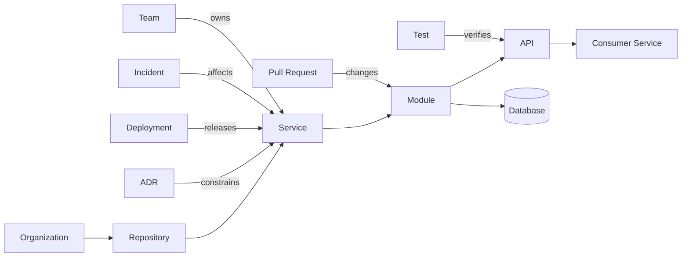
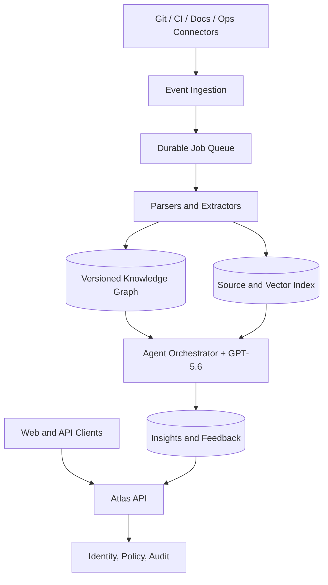

# Atlas Genesis

> **Atlas — The AI Engineering Operating System**

## 1. Vision

Atlas exists because software is more than its source code. A production system is the accumulated result of decisions, constraints, incidents, migrations, ownership changes, deployment practices, and trade-offs. Much of that understanding is currently distributed across repositories, pull requests, tickets, runbooks, dashboards, and the memories of people who may no longer be present.

The result is an engineering organization that can execute quickly only while a small number of people remember why the system is the way it is. As the system and team grow, discovering intent becomes slower than changing code. Atlas makes that intent durable, inspectable, and useful.

Atlas is the AI Engineering Operating System: a continuously maintained model of a software organization’s engineering reality, paired with an AI engineer that reasons over that model. It should give every repository the continuity, context, and judgment of a senior engineer who has studied its history, architecture, operations, and current change stream.

The intended future is not one where developers surrender engineering judgment to automation. It is one where engineers spend less time reconstructing context and more time making sound decisions. Atlas preserves institutional engineering knowledge so that systems remain understandable as they evolve.

## 2. Mission

Atlas’s long-term mission is to make reliable engineering understanding available to every software team at the moment it is needed.

This means Atlas must continuously turn evidence into an explicit, evolving engineering model; identify uncertainty rather than invent certainty; explain conclusions with traceable provenance; and help teams choose and execute the next responsible action. It must work across code, infrastructure, delivery, and operational history—not merely answer questions about snippets of source text.

In the long term, Atlas will become the durable engineering memory for an organization: a system that knows what exists, how it relates, why it changed, who is responsible, what is at risk, and what should be investigated next.

## 3. Product Philosophy

Atlas is built on several beliefs. First, engineering context is a first-class artifact. Architecture and operational knowledge should be represented with the same rigor as source code. Second, conclusions require evidence. The system must distinguish observed facts, derived inferences, and recommendations. Third, a repository is not an isolated unit: it is a participant in a system of services, teams, dependencies, and deployments.

Atlas treats software as a living system. Its model is continuously revised by commits, pull requests, CI results, deployments, incidents, documentation updates, and human corrections. It does not claim that an initial index is permanent truth. It maintains a versioned understanding of what was true, when it was true, and why it believes it.

Finally, Atlas is proactive but never presumptuous. It can surface drift, risk, missing ownership, and migration opportunities without waiting for a prompt. It does not silently rewrite systems, merge code, or substitute its judgment for accountable engineers.

## 4. Problem Statement

Software engineering has a memory problem. Source control records edits, but not a usable model of intent. Documentation records some decisions, but usually diverges from implementation. Issue trackers record work, but rarely remain connected to the code and architecture they changed. Monitoring systems reveal symptoms, but not the design history that makes the symptoms meaningful.

This fragmentation produces expensive, recurring work:

- New engineers spend weeks locating system boundaries and unwritten conventions.
- Reviewers assess local diffs without seeing cross-service or deployment consequences.
- Teams repeat incident investigations because learnings never become structured engineering knowledge.
- Refactors stall because dependency and ownership impact is uncertain.
- Documentation becomes a liability when readers cannot tell whether it still describes the running system.
- Departing engineers take critical context with them.

The central problem is not lack of data. Teams have abundant data. The problem is that evidence is disconnected, time-sensitive, and difficult to reason over as a whole. Search can locate a file; it cannot reliably establish that an API is consumed by three services, owned by nobody, changed after an incident, and scheduled for replacement by an approved ADR.

## 5. Current Landscape

Today’s developer tooling is valuable and increasingly capable. IDE assistants accelerate local implementation. Code-search and repository-chat tools improve discovery. Static analysis finds defined classes of defects. Review automation improves consistency. Project trackers coordinate work, while observability platforms provide operational evidence.

Their shared limitation is scope. Most tools treat the repository, diff, ticket, trace, or dashboard as the primary unit of understanding. They retrieve relevant artifacts and produce assistance around the artifact in front of the user. This is effective for many tasks, but it leaves the relationship between artifacts largely implicit.

| Tool category | Principal strength | Typical unit of context | Gap Atlas addresses |
|---|---|---|---|
| Coding assistants | Faster authoring and local debugging | Open files and workspace | Persistent system-level memory |
| Code review tools | Diff-oriented feedback | Pull request | Architectural and historical impact |
| Static analysis | Repeatable rule enforcement | Code pattern | Intent, ownership, and change history |
| Project tracking | Work coordination | Ticket/project | Verified linkage to implementation and delivery |
| Observability | Runtime signals | Service/trace/metric | Connection to architecture and decisions |

Existing tools often fail to understand bounded contexts, whether implementation still conforms to an ADR, the lifecycle of an interface across repositories, who owns an unowned dependency, or whether a seemingly safe change expands a known operational risk. These are relationship and history questions. Atlas is designed around them.

## 6. Atlas

Atlas is a platform built around **Atlas Memory Graph (AMG)** and GPT-5.6-backed specialized agents that reason over it. Atlas continuously ingests engineering evidence, resolves it into entities and relationships, records temporal changes, and produces explainable engineering insights. Atlas Memory Graph (AMG) is the canonical term for the durable system of understanding at Atlas’s core.

Atlas is not a replacement IDE, a general-purpose chat interface, a linter, an autonomous merge bot, an issue tracker, or an observability vendor. It may integrate with each of these systems. It should improve their usefulness by supplying the architectural and historical context they lack.

An Atlas insight is an engineering object, not an unstructured notification. It has a subject, severity or confidence where appropriate, supporting evidence, affected scope, a timestamp, a lifecycle, and a recommended next action. Engineers can accept, dismiss, correct, assign, or link it to work. Those decisions become part of the system’s memory.

## 7. Product Principles

The following principles are non-negotiable.

1. **Evidence before assertion.** Every material conclusion links to source evidence and states whether it is observed or inferred.
2. **Temporal truth matters.** Atlas preserves historical states; it never overwrites the fact that a dependency, owner, or architecture existed at a prior point in time.
3. **Human accountability remains explicit.** Atlas recommends and explains; authorized humans decide and act.
4. **Graph first, retrieval second.** Retrieval supplies evidence, while the graph supplies system structure, constraints, and impact paths.
5. **Incremental by default.** New events update affected subgraphs; Atlas does not repeatedly re-analyze an entire organization without need.
6. **Least-privilege integration.** Read-only access is the default. Write actions require explicit product configuration and an auditable identity.
7. **Useful uncertainty.** Confidence, missing evidence, and contradictory signals are surfaced rather than masked.
8. **No dark patterns in engineering workflow.** Alerts must be actionable, deduplicated, attributable, and dismissible.

## 8. Atlas Memory Graph and Engineering Knowledge

### Philosophy and model

The **Atlas Memory Graph (AMG)** is Atlas’s canonical representation of engineering reality. It is not a code-property graph alone, nor a document index with links. It combines deterministic extraction with evidence-backed semantic interpretation and represents relationships as typed, versioned facts.

Every node and edge has stable identity, source provenance, validity interval, ingestion time, confidence, and visibility policy. “Service A calls Service B” is therefore not a timeless sentence; it is a claim supported by code, configuration, traces, or declarations, valid for a definable period and open to revision.

### Entities and relationships

Core entity types include organization, team, engineer, repository, service, bounded context, package, module, file, symbol, API, schema, database, queue, infrastructure resource, environment, test, build, pull request, commit, release, deployment, incident, ADR, document, ticket, ownership assignment, dependency, and insight.

Relationships are typed and directional where appropriate: `contains`, `defines`, `imports`, `calls`, `publishes_to`, `consumes_from`, `reads_from`, `writes_to`, `deploys_to`, `depends_on`, `owned_by`, `changed_by`, `introduced_by`, `constrained_by`, `supersedes`, `documents`, `verifies`, `violates`, `affected_by`, and `derived_from`. Relationship strength may be deterministic, observed, declared, or inferred.

### Continuous updates and reasoning

Webhook events and scheduled reconciliations create graph update jobs. A commit updates symbols and local dependencies; a merged pull request connects rationale and review decisions; a deployment activates a release/environment relationship; an incident records impact and mitigations. The graph maintains snapshots and deltas so Atlas can answer both “what depends on this now?” and “what changed between the last healthy deployment and the incident?”

Graphs outperform isolated retrieval for system questions because they support constrained traversal, path explanation, and relationship aggregation. Retrieval can find an ADR mentioning Kafka. The graph can enumerate the topics it governs, the producers and consumers, their owners, deployments after an ADR date, and incidents touching that path. Retrieval remains essential for the underlying text; it is not the system of record for relationships.

## 9. Engineering Memory Model

AMG is not a store of current facts. It is an engineering memory model: a versioned account of how knowledge was created, challenged, changed, and used. Current state is important, but alone it cannot explain why an interface exists, why a trade-off was accepted, or whether a conclusion remains trustworthy after the evidence changes.

Each material memory is represented as an evidence-backed record with the following dimensions:

| Dimension | Meaning | Example |
|---|---|---|
| Entity | The engineering object being understood | `payments-api` service or `ChargeCreated` event |
| Fact or decision | The asserted state or chosen course | “The event is versioned” or “Use an outbox pattern” |
| Evidence | Immutable source references supporting it | Commit, ADR, manifest, trace, PR review, incident record |
| Confidence | Strength and type of support | Deterministic, declared, observed, or inferred; with score and rationale |
| Owner | Accountable team or named role | Payments Platform team |
| Reasoning | The derivation and relevant constraints | Contract tests and three consumer references demonstrate compatibility requirement |
| Historical timeline | When the memory was valid or altered | Introduced in release 2.4; superseded by ADR-018 |
| Corrections | Human or system amendments to prior understanding | Architect confirms inferred consumer is a retired integration |
| Relationships | Links to affected and supporting memories | Depends on Kafka topic, constrained by ADR, related to incident |

Facts, decisions, and recommendations are deliberately separate. A parsed import statement is a fact. An ADR approved by an accountable group is a decision. “Migrate this dependency before deprecation” is a recommendation. Atlas may connect these records, but must never present a recommendation as a fact or infer organizational intent without identifying uncertainty.

Corrections are first-class memory events, not destructive edits. If an owner disputes a dependency or an engineer confirms that a document is obsolete, Atlas records who corrected it, why, when, and which previous claim was affected. The prior claim remains historically queryable, with its status changed. This gives teams a trustworthy answer to both “what do we believe now?” and “why did we change our mind?”

Engineering memory has an explicit lifecycle: proposed, verified, active, challenged, superseded, deprecated, and archived. Automatic evidence can propose or challenge a memory. Human authority verifies decisions, ownership, and exceptions. Policies define which memory types expire, require review, or cannot be inferred. The model therefore becomes more reliable with use instead of accumulating opaque summaries.

## 10. Repository Pulse

**Repository Pulse** is Atlas’s primary operating view and its most immediate expression of engineering intelligence. It answers a simple question every engineering leader and maintainer asks: *what is the current condition of this repository, and what needs attention?*

Pulse is not a vanity health score. It is an explainable, composable assessment derived from AMG evidence, with each dimension independently inspectable. Its role is to orient users in seconds and guide them into the evidence—not to reduce system health to a single unexplained number.

| Pulse dimension | What it assesses | Typical contributing evidence |
|---|---|---|
| Overall Health | Weighted synthesis of material dimensions | Open risks, freshness, delivery signals, coverage and policy state |
| Architecture | Boundary integrity and dependency condition | Cycles, unapproved coupling, ADR conformance, interface changes |
| Documentation Drift | Difference between documented intent and implementation | Stale ADRs, changed APIs, outdated runbooks, missing interface docs |
| Deployment Risk | Risk of the next or recent production change | Blast radius, test signals, change history, ownership, rollback readiness |
| Knowledge Coverage | How much relevant system understanding is evidence-backed | Mapped services, APIs, owners, dependencies, and current documentation |
| Ownership | Clarity and completeness of accountability | CODEOWNERS, catalog ownership, unresolved handoffs, orphaned components |
| AI Confidence | Confidence in Atlas’s assessment, not quality of the code | Evidence freshness, ambiguity, parser coverage, contradictory sources |

An initial Pulse might show Overall Health at 95%, Architecture as Healthy, two documentation-drift findings, Medium deployment risk, 98% knowledge coverage, complete ownership, and 94% AI confidence. Selecting any dimension reveals its formula, contributing facts, excluded or uncertain evidence, historical trend, and recommended action. A high health score with low AI confidence is displayed as low-confidence assessment, not as reassurance.

Pulse operates at repository, service, bounded-context, and organization levels. It supports a temporal comparison so users can see whether health changed after a release, migration, or ownership transition. Scores are calibrated per organization policy and never used to rank individual engineers. Their purpose is engineering stewardship: identify areas that need understanding or intervention before they become expensive.

## 11. AI Engineering System

Atlas uses specialized agents operating on a shared graph and a common evidence contract. Agents do not maintain private, incompatible memories. The Orchestrator assigns bounded work, assembles results, resolves conflicts, and enforces policy.

| Agent | Responsibilities | Primary inputs | Outputs |
|---|---|---|---|
| Architect | Reconstruct boundaries, interfaces, and design conformance | Code graph, ADRs, infrastructure | Architecture map, drift findings |
| Historian | Explain why and when decisions changed | Git, PRs, tickets, ADRs, incidents | Decision timelines, provenance narratives |
| Reviewer | Evaluate proposed changes in system context | Diff, tests, dependency paths | Risk-aware review findings |
| Planner | Produce sequenced implementation or migration plans | Target state, graph, constraints | Milestones, dependency-aware plan |
| Librarian | Maintain documentation coverage and freshness | Docs, code changes, ownership | Drift findings, documentation tasks |
| Forecaster | Estimate engineering and delivery risk | Change history, ownership, CI, operations | Risk signals and contributing factors |
| Orchestrator | Route work, validate evidence, coordinate lifecycle | User/event triggers and all outputs | Composite answer or insight |

Agent outputs are structured: claim, scope, evidence references, reasoning summary, confidence, assumptions, counterevidence, recommended action, and status. The Orchestrator may ask another agent to challenge a result when evidence conflicts or the consequence is material. No agent may create a graph fact without provenance; semantic inferences are explicitly labeled as such.

## 12. Repository Intelligence Pipeline

Repository onboarding starts with explicit connection authorization and scope selection. Atlas verifies access, records the selected default branch and environments, and performs an initial bounded analysis. The pipeline is idempotent; reruns produce the same graph state from the same source state.

```mermaid
flowchart LR
  A[Git provider webhook / sync] --> B[Acquire immutable revision]
  B --> C[Classify repository and languages]
  C --> D[Parse code and build deterministic code graph]
  D --> E[Extract manifests, IaC, CI, docs, tests]
  E --> F[Resolve entities and cross-repo references]
  F --> G[Version AMG facts]
  G --> H[Run targeted agent reasoning]
  H --> I[Insights, API, UI, notifications]
```

At ingestion Atlas collects repository metadata, branch and commit history, file trees, language-aware abstract syntax trees, package manifests and lockfiles, build definitions, CI workflows, infrastructure-as-code, API specifications, database migrations, tests, documentation, ownership files, and ADR conventions. Connectors may additionally ingest pull requests, issue references, deployments, incidents, and service catalog metadata.

Language parsers generate deterministic symbols, imports, call edges, inheritance relationships, and test associations. Extractors identify conventions such as OpenAPI specifications, Terraform resources, Kubernetes manifests, message topics, SQL migrations, and CODEOWNERS. An entity-resolution stage reconciles multiple references to the same service or resource. When resolution is ambiguous, Atlas retains alternatives or requests human confirmation; it does not silently collapse them.

Embedding and full-text indexes are built for supporting artifacts, segmented by semantic boundaries such as ADR sections, symbols, and PR discussion threads. They serve citation retrieval and agent context, while graph updates remain driven by typed extraction and validated inference.

## 13. Continuous Reasoning Engine

GPT-5.6 is used as a reasoner over an evidence package, not as an omniscient source of truth. For a question or event, Atlas first defines scope, traverses relevant graph neighborhoods, retrieves primary source excerpts, and composes a bounded context bundle. The model receives an explicit task, graph paths, source excerpts, time bounds, organization policy, and required output schema.

Reasoning follows a disciplined loop:

1. Formulate the engineering question and acceptance conditions.
2. Gather deterministic graph facts and the smallest relevant evidence set.
3. Identify missing information and contradictions.
4. Derive claims only from the supplied evidence; mark hypotheses separately.
5. Validate proposed claims against graph constraints and policy.
6. Persist approved insights with citations and expiry/re-evaluation triggers.

For example, a pull request altering an event schema causes Atlas to traverse producers, consumers, deployed versions, contract tests, and recent incident history. Reviewer evaluates compatibility; Forecaster estimates risk using change frequency, test coverage, ownership concentration, and deployment history; Planner proposes an ordered migration if compatibility is not established. The result explains paths such as `PR → schema → topic → consumer → production deployment`, rather than simply saying “this looks risky.”

Continuous reasoning is event-driven and budgeted. High-signal events—merged changes to shared APIs, failed production deployments, ownership removals, or ADR updates—trigger targeted analysis. Lower-priority hygiene analyses run on schedules. Atlas deduplicates similar findings, suppresses stale alerts, and re-evaluates an insight when its supporting graph facts change.

## 14. User Experience

The first experience is onboarding, not chat. A team connects a repository, identifies its owning team and environments, and reviews Atlas’s initial system map. Atlas explicitly shows confidence and unresolved boundaries, inviting correction. This establishes a collaboration loop: the organization teaches Atlas local truth, and Atlas preserves it.

The home view opens with Repository Pulse, then an engineering briefing. Pulse establishes current condition; the briefing shows material architectural changes, active insights, ownership gaps, documentation drift, and delivery risks sorted by impact and confidence. It is not an activity feed. Each item answers: what changed, why it matters, what evidence supports it, who is affected, and what action is available.

The system map lets users move from a bounded context to services, dependencies, APIs, resources, owners, recent changes, deployments, and related incidents. Every view supports a temporal lens. A user can ask why a service depends on a database, what changed before a regression, or which consumers would be affected by retiring an endpoint—and receive graph paths plus cited source material.

During a pull request, Atlas adds a system-context panel: affected components, dependency paths, relevant ADRs, ownership, missing tests, and risk factors. Findings are advisory and explainable. During an incident, an incident workspace centers the affected services, recent deployments, dependency topology, known failure history, and available runbooks. After remediation, Atlas can propose knowledge updates for human review.

The conversational interface is a gateway to the model, not the product itself. A question produces a bounded answer with sources, assumptions, and links into the graph. Users can correct facts, add an ownership assignment, confirm an inferred relationship, or dismiss an insight with a reason. Those actions are auditable and drive future reasoning.

## 15. Product Pillars

Atlas is differentiated by five connected pillars:

- **Atlas Memory Graph:** a versioned, evidence-backed engineering memory rather than a periodically regenerated repository summary.
- **Repository Pulse:** an explainable operating view of engineering condition, coverage, and confidence.
- **Engineering memory:** durable links among code, decisions, delivery, and operations.
- **Proactive intelligence:** targeted insights triggered by meaningful system events.
- **Explainable judgment:** every result exposes scope, evidence, confidence, and reasoning path.
- **Workflow continuity:** knowledge appears in architecture work, review, planning, and incident response without forcing a new system of record.

No individual pillar is sufficient alone. A graph without reasoning is a catalog. Reasoning without durable memory repeats discovery. Alerts without workflow context become noise. Atlas is the operating system because these capabilities share one engineering model.

## 16. Competitive Positioning

Atlas complements established tools; it occupies a different primary role.

| Product | Primary philosophy | Atlas distinction |
|---|---|---|
| GitHub Copilot | Assist code creation in developer workflows | Atlas maintains a cross-artifact engineering model and reasons proactively |
| Cursor | AI-native IDE workflow | Atlas is IDE-agnostic and operates at repository, service, and organization scope |
| Claude Code | Agentic codebase work through a developer interface | Atlas supplies persistent graph memory and continuous system analysis |
| Codex | AI-assisted software engineering and coding tasks | Atlas is a durable engineering intelligence layer across connected systems |
| SonarQube | Static quality and security analysis | Atlas connects code quality to architecture, history, ownership, and operations |
| CodeRabbit | Automated pull-request review | Atlas provides review context plus ongoing architectural understanding |
| Linear | Product and engineering work management | Atlas links work intent to verified system reality; it does not replace planning workflow |
| Datadog | Runtime observability and operational telemetry | Atlas connects runtime signals to code, decisions, ownership, and change history |

These tools can be sources of evidence and destinations for Atlas insights. Atlas should not claim to supersede mature capabilities such as an IDE, static analyzer, issue tracker, or telemetry platform. Its role is to make their information coherent in engineering decisions.

## 17. MVP

Version 1 proves that a living engineering model produces decisions developers can trust. It ships with GitHub App integration; repositories and default-branch ingestion; TypeScript, Python, and Terraform parsing; manifests, tests, Markdown/ADR, CODEOWNERS, Git history, pull-request, and GitHub Actions ingestion; Atlas Memory Graph; initial system map; searchable engineering memory; Repository Pulse; and a web experience for insights and evidence exploration.

V1 agents are Architect, Historian, Librarian, and Reviewer, coordinated by Orchestrator. Initial proactive insights are: documentation drift after interface changes, missing or conflicting ownership, unreferenced or stale ADRs, cross-module dependency changes, and pull-request impact summaries. Each is bounded by confidence rules and includes citations.

V1 does **not** ship autonomous code modification, automatic merging, a custom code editor, arbitrary production access, live distributed tracing ingestion, full incident-command functionality, support for every language, an enterprise data warehouse, a ticketing replacement, or predictive estimates presented as certainty. Slack or ticket creation may be surfaced as future integrations, but not required for V1 value.

## 18. Technical Vision

Atlas is a multi-tenant platform with a logically isolated organization boundary. The control plane manages identity, integration grants, policy, billing, and audit. The data plane processes customer evidence under tenant-scoped authorization and encryption. Raw source access is minimized, retention is configurable, and derived artifacts retain provenance back to immutable source revisions.

The graph store must support typed edges, temporal queries, provenance, tenant isolation, and efficient neighborhood traversal. A relational store retains transactional entities, policy, and workflow state; object storage retains immutable source snapshots and parsed artifacts; a search layer supports source citation retrieval. Event handling is idempotent, ordered where required by repository revision, and observable through end-to-end job traces.

Security is product architecture, not a later feature. Atlas uses OAuth or app installations with scoped permissions, encrypts data in transit and at rest, records access and model actions, supports customer-controlled retention, and prevents cross-tenant retrieval at every layer. Model context is tenant-scoped and policy-filtered. Sensitive-code handling, model-provider terms, regional residency, and enterprise isolation are explicit roadmap commitments, not implicit promises.

## 19. Product Roadmap

| Version | Objective | Capability boundary |
|---|---|---|
| V1: Foundation | Establish trusted repository intelligence | GitHub, core graph, initial languages, map, evidence-backed insights and PR context |
| V2: Connected Engineering | Model system interactions and team workflow | More languages, GitLab, service catalog/CI integrations, deployment and incident context, migration planning, team portfolios |
| V3: Engineering OS | Operate across the organization’s engineering lifecycle | Broader operational integrations, policy-aware change orchestration, advanced forecasting, validated write workflows with explicit approval |

V2 focuses on cross-repository truth: service boundaries, API contracts, environment topology, deployment relationships, and delivery history. It adds Planner and Forecaster in production form, richer change-impact analysis, and formal feedback loops for architecture governance.

V3 expands from understanding to governed coordination. Atlas may prepare implementation branches, update documentation, open tasks, or orchestrate approved changes only within explicit policy and human approval gates. Autonomous action is earned through trust, not assumed as a roadmap feature.

## 20. Success Metrics

Atlas is successful when it measurably reduces the cost of recovering engineering context while increasing confidence in change decisions. Metrics must measure trust and outcomes, not raw model activity.

| Dimension | Measures |
|---|---|
| Knowledge coverage | % of in-scope repos mapped; resolved service/owner/API coverage; documentation-to-code linkage |
| Freshness | Median time from source event to graph update; stale insight rate |
| Trust | Insight acceptance/correction/dismissal rates; citation usefulness; false-positive rate by insight type |
| Workflow value | Time to answer architecture/history questions; PR review-context usage; time to orient new engineers |
| Engineering outcomes | Prevented incompatible changes, resolved ownership gaps, drift remediation rate, reduced repeat incident investigation |
| Reliability | Ingestion success, graph query latency, event lag, connector availability, audit completeness |

The North Star is **verified engineering understanding at the point of change**: the proportion of material engineering decisions for which Atlas provides accurate, cited system context before the decision is made. This is measured through sampled user feedback and outcome review, not inferred merely from page views.

## 21. Engineering Principles

### Coding philosophy

Atlas code favors clarity, determinism, and explicit contracts over cleverness. Parsers, graph mutations, policies, and agent schemas are versioned interfaces. Side effects are isolated; event handlers are idempotent; failures preserve enough context for replay and diagnosis. Generated conclusions must be reproducible from retained evidence and model/version metadata where policy permits.

### Architecture philosophy

The system is modular around stable domains: integrations, extraction, graph, reasoning, insights, identity/policy, and presentation. Modules communicate through versioned events and APIs. We avoid distributed complexity until scale or isolation requirements justify it. Every architectural decision records alternatives, consequences, owner, and review date in an ADR linked to the implementation it governs.

### Documentation philosophy

Documentation describes intent, invariants, interfaces, operating procedures, and decisions—not code that can be mechanically derived. It has named ownership and review triggers. Atlas itself must use its Librarian capabilities to detect when its own docs no longer correspond to system behavior. User-facing claims require a defined capability and measurable behavior.

### Testing philosophy

Testing is layered. Unit tests protect deterministic extraction and graph transforms. Contract tests protect connectors and external schemas. Integration tests validate ingestion-to-insight paths. Evaluation suites test agent outputs against curated engineering scenarios for citation accuracy, unsupported-claim rate, useful actionability, and policy adherence. Security, tenancy, and permission boundaries receive adversarial tests. A change is not complete when it compiles; it is complete when its behavior, failure mode, and observability are verified.

## 22. Closing Manifesto

The enduring asset of a software company is not only the code it ships. It is the understanding that lets its people change that code safely: the reasons behind boundaries, the lessons behind guardrails, the history behind a workaround, and the relationships that turn a local edit into a system-wide decision.

That understanding should not disappear into chat threads, forgotten pull requests, and the heads of a few exhausted experts. It should be continuously assembled from evidence, corrected by the people closest to the work, and made available wherever engineering judgment is required.

Atlas is built for that future. Every repository deserves an AI engineer that learns its structure, remembers its history, recognizes its risks, explains its constraints, and helps its humans improve it. Not a chatbot waiting for a question. An engineering presence that keeps the system understandable as it changes.

When every software system can retain and apply its own engineering memory, teams will move with greater confidence—not because complexity disappears, but because understanding no longer does.
