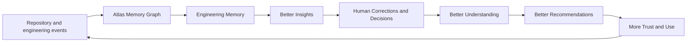

# Atlas Product Strategy

**Status:** Founding product strategy  
**Authority:** Product strategy is subordinate to `ATLAS_GENESIS.md`, which remains the product and technical constitution.  
**Audience:** Founders, product leadership, engineering leadership, early design partners, and investors evaluating execution strategy.

## Executive Summary

Atlas is the AI Engineering Operating System. It gives software organizations a continuously updated, evidence-backed understanding of their engineering systems, then uses that understanding to surface risks, preserve decisions, and guide responsible change.

The product exists because engineering knowledge decays faster than source code. A company may have repositories, pull requests, documentation, tickets, CI results, deployments, incidents, and dashboards, yet still be unable to answer basic consequential questions quickly: Who owns this service? Which consumers will this API change break? Why was this database introduced? Did the architecture drift from the approved decision? What changed before the last incident? Today, those answers live in disconnected tools and in the memories of a shrinking set of experienced people.

Atlas does not solve this by offering another chat window over a repository. Its core is the **Atlas Memory Graph (AMG)**: a versioned engineering memory that connects code, dependencies, services, decisions, tests, owners, deployments, and incidents. Every meaningful claim has evidence, confidence, temporal validity, and a correction history. Atlas’s specialized agents reason over this model to produce explainable insights in the moments where engineering judgment is required.

Why now: AI coding capability has made local code production dramatically cheaper. The limiting factor is increasingly system understanding: architecture, constraints, downstream impact, and operational context. At the same time, software organizations are becoming more distributed, codebases more interconnected, and experienced engineers more scarce relative to the systems they maintain. The cost of not remembering is rising.

Atlas matters because it changes the default from rediscovering context to retaining it. It helps a staff engineer review an API change with known consumers and decision history; an engineering manager find ownership gaps before an incident; a new developer understand a service in hours rather than weeks; and a CTO govern architectural complexity without relying on anecdotes. The first product expression is **Repository Pulse**, an explainable operating view of repository condition, coverage, confidence, drift, ownership, and deployment risk.

The strategic wedge is not “AI for all engineering.” It is trusted engineering understanding for teams whose systems have become too consequential to rely on tribal knowledge. Atlas earns expansion by becoming useful in one repository, then increasingly valuable as it connects repositories, teams, delivery history, and operational evidence.

## The Problem

Software teams do not primarily suffer from a shortage of files, dashboards, or messages. They suffer from fragmented meaning. A codebase can be technically accessible while its architecture, intent, accountability, and history are practically unavailable.

Architectural drift occurs when systems evolve through reasonable local changes that collectively violate the boundaries, interfaces, or trade-offs originally intended. Documentation drift follows when design documents and runbooks stop reflecting what actually runs. Neither is usually caused by negligence. Both arise because maintaining a complete mental model of a changing system is expensive and no existing workflow makes it continuous.

Institutional knowledge loss compounds this. Teams often depend on a few long-tenured engineers who know why a workaround exists, which service is the real source of truth, or why a migration stopped halfway. When those people change teams or leave, the organization retains commits but loses explanations. New hires inherit a system whose most important constraints are implicit.

Ownership ambiguity creates a similar failure mode. A component may have code owners but no accountable operational owner; an API may have many consumers but no steward; an infrastructure resource may outlive its original team. During normal operation, these gaps are inconvenient. During an incident or risky migration, they become coordination failures.

Dependency uncertainty makes engineering conservative in the wrong places and reckless in others. Teams delay necessary change because they cannot establish blast radius, then accidentally break integrations because the same dependency map is incomplete. Technical debt becomes an unprioritized inventory rather than a connected risk: a legacy library, an undocumented schema, a deprecated endpoint, and a fragile deployment pipeline may be facets of one problem that no tool presents together.

Current workflows fail because they are artifact-centered. Git records changes, but does not form a usable model of decision intent. Issue trackers coordinate work, but do not verify that a ticket’s assumptions still match production. Documentation captures selected knowledge, but does not react when code changes. Observability describes runtime behavior, but not the design history behind it. Humans bridge these systems manually, repeatedly, and under time pressure.

## Why Existing Solutions Fall Short

Existing categories solve real problems and remain essential to Atlas customers. The gap is not a lack of capable tools; it is the lack of a durable, connected engineering model between them.

| Category | What it does well | Where Atlas extends the workflow |
|---|---|---|
| IDE assistants | Accelerate implementation, explanation, and local debugging | Preserves cross-repository history, ownership, dependencies, and operational context |
| Repository chat | Retrieves and explains repository artifacts | Maintains a temporal relationship model rather than answering from a transient retrieval set |
| Static analysis | Enforces deterministic quality, security, and style rules | Connects findings to architecture, decision history, ownership, and delivery risk |
| Observability | Detects and investigates runtime behavior | Relates production signals to code changes, services, ADRs, and accountable teams |
| Project management | Coordinates goals, work, and prioritization | Verifies the system context and implementation impact behind planned work |
| Documentation systems | Publish durable human guidance | Detects whether guidance still corresponds to implementation and operations |

These tools typically begin with an open file, a query, a diff, a ticket, or a trace. Atlas begins with the engineering system. It treats those artifacts as evidence and connects them through AMG. This does not diminish existing tools; it makes the information they produce more coherent at the moment of decision.

## Vision

The future state is simple to describe: every repository has an AI engineer.

That engineer is not a chatbot waiting for a prompt, and it is not an autonomous actor with undefined authority. It continuously learns the system’s structure, tracks its changes, remembers its decisions, identifies uncertainty, and presents evidence-backed guidance. It knows that a repository is part of a larger organization: services consume APIs, teams own components, decisions constrain designs, deployments activate releases, and incidents reveal weaknesses.

Atlas is an Engineering Operating System because it provides a shared operating model for these relationships. An operating system does not replace every application; it creates consistent primitives through which applications and users coordinate. Atlas similarly does not replace the IDE, Git host, ticket system, or observability stack. It makes their engineering information connected, current, and actionable.

## Target Customers

The first customer is an engineering organization with meaningful software complexity and insufficient shared context—not a solo developer or a team with a single simple repository.

| Segment | Need | Timing |
|---|---|---|
| Primary: scaling product teams | Preserve understanding as services, teams, and change volume grow | Initial paid customer |
| Secondary: platform and infrastructure teams | Govern dependencies, ownership, and reliability across many consumers | Early expansion within an account |
| Secondary: regulated or high-consequence teams | Demonstrate decision lineage, ownership, and change context | Enterprise motion after trust controls mature |
| Later: large enterprises | Establish organization-wide engineering memory and governance | Multi-repository, multi-system deployment |

Early adopters are technically mature teams of roughly 30–250 engineers, usually with several repositories or services, GitHub-centered workflows, CI/CD, an existing documentation practice, and a visible pain around onboarding, architecture, or production risk. They already use tools such as an IDE assistant, issue tracker, and observability product. They do not need to be persuaded that software complexity is real; they need an answer that does not require replacing their existing stack.

Developers benefit first through faster context recovery and safer reviews. Staff and principal engineers benefit through architecture visibility and durable decision history. Managers benefit through ownership and risk visibility. The CTO benefits later, once Atlas provides trustworthy organization-wide trends rather than a collection of local observations.

## Ideal Customer Profile

The ideal initial customer has 50–500 engineers, 10–100 actively maintained repositories, TypeScript and/or Python in a significant portion of the estate, GitHub and GitHub Actions, and a service-oriented or rapidly modularizing architecture. Terraform, Kubernetes, OpenAPI, ADRs, CODEOWNERS, and a service catalog are advantageous but not prerequisites.

Their visible pain is not “we need more AI.” It is one or more concrete failures: onboarding is slow; dependency impact is hard to establish; platform engineers cannot prove ownership; documentation is mistrusted; incidents repeatedly require archaeology; or architecture reviews cannot keep up with change. Their buying motivation is reduced risk and less time spent recovering context, with productivity as a consequence rather than an empty promise.

Success means a team can onboard a repository quickly, trust Atlas’s map and citations, identify at least one previously hidden ownership or drift issue, and use system context in actual pull-request, migration, or incident work. The customer should be able to explain the value in terms of engineering decisions made with better evidence.

## User Personas

| Persona | Goals | Frustrations | How Atlas helps |
|---|---|---|---|
| Engineering Manager | Deliver reliably, distribute knowledge, reduce single points of failure | Unclear ownership; recurring escalations; status inferred from anecdotes | Repository Pulse, ownership gaps, knowledge coverage, and risk trends |
| Staff Engineer | Preserve architecture while enabling teams to move | Local changes obscure system effects; decisions are forgotten | Architecture map, ADR linkage, impact paths, and drift findings |
| Platform Engineer | Make shared services safe and easy to consume | Unknown consumers, fragmented service metadata, migration uncertainty | Consumer mapping, contract context, service ownership, and migration plans |
| Developer Experience Team | Improve engineering flow and onboarding | Tool sprawl makes systemic friction difficult to measure | Evidence-backed insight into recurring context and workflow failures |
| CTO | Scale output without scaling confusion and operational risk | No trustworthy view of engineering condition across teams | Organization Pulse, trends, governance evidence, and risk visibility |
| Principal Engineer | Guide long-lived technical direction | Architectural reasoning is scattered across old discussions and code | Historical decision timelines and cross-domain system understanding |

Atlas must not treat these personas as different products. They consume different views of the same evidence-backed model. A manager’s ownership gap must lead to the same source evidence a staff engineer can inspect; a CTO’s risk trend must never conceal uncertainty that a platform engineer needs to act on.

## Core Value Proposition

Atlas transforms engineering knowledge from a private, decaying resource into a maintained organizational capability.

| Before Atlas | After Atlas |
|---|---|
| Context is recovered manually from files, conversations, and memory | Context is assembled from a versioned graph with source provenance |
| Architecture is a diagram that becomes stale | Architecture is a living, evidence-backed system map |
| Documentation is trusted or ignored without a freshness signal | Documentation drift is identified and linked to implementation changes |
| Change impact is estimated from intuition | Impact is explored through consumers, owners, tests, deployments, and decisions |
| Incidents trigger repeated archaeology | Operational lessons become connected engineering memory |
| Ownership is scattered across conventions | Ownership gaps are visible and actionable |

The transformation is not “fewer engineers needed.” It is better judgment at scale. Atlas lowers the cost of understanding a system before changing it and lowers the chance that organizational memory disappears after a change, incident, or departure.

## Product Positioning

**Atlas is the AI Engineering Operating System that maintains an evidence-backed memory of how software systems work, change, and fail.**

Atlas is a living engineering intelligence layer. It is a versioned system map, decision memory, proactive insight engine, and explainable interface for engineering context. It is not another code completion product, repository chatbot, static analyzer, project manager, observability platform, or autonomous merge agent.

Its defining distinction is philosophical: Atlas reasons over connected engineering reality, while most tools provide valuable assistance around an individual artifact or workflow. Atlas integrates with those workflows rather than asking teams to abandon them.

## Competitive Positioning

Atlas competes for attention and budget in a developer-tooling environment, but its most important position is complementary. Coding tools help create and modify software. Review tools focus on proposed diffs. Static analysis finds codified classes of issues. Observability tools reveal runtime signals. Planning and documentation tools coordinate human work and publish intent.

Atlas connects these sources into AMG and keeps that connected understanding current. Its advantage will not come from claiming that a graph is novel or that an LLM can answer engineering questions. It will come from trustworthy continuity: evidence, temporal history, correction, and workflow presence. If a customer believes Atlas but cannot trace why, the product has failed its positioning.

## The Atlas Flywheel

1. **Repository and engineering events:** commits, pull requests, tests, documentation, ownership changes, releases, and incidents provide new evidence.
2. **Atlas Memory Graph:** deterministic extraction and careful entity resolution connect that evidence into typed, temporal relationships.
3. **Engineering memory:** facts, decisions, confidence, timelines, and corrections persist rather than becoming a one-time answer.
4. **Better insights:** specialized agents can identify drift, impact, risk, and missing information using connected evidence.
5. **Human corrections and decisions:** engineers validate, challenge, dismiss, or enrich Atlas conclusions; these are durable memory events.
6. **Better understanding:** corrections improve local truth and clarify the organization’s actual conventions.
7. **Better recommendations:** Atlas can propose more relevant next actions while making uncertainty explicit.
8. **More trust and use:** useful, cited outputs become part of review, planning, onboarding, and incident practice, generating further high-quality evidence.

The flywheel is only defensible if correction is easy and trust is earned. More data without governance produces noise, not advantage.

## Network Effects

Atlas has primarily organization-internal network effects. Each connected repository makes other repositories more understandable because interfaces, shared packages, deployments, owners, and architectural decisions cross repository boundaries. Each verified relationship improves the precision of future impact analysis. Each correction prevents future teams from repeating the same misunderstanding.

There is also a workflow network effect: when Atlas is used in pull requests, migration planning, and incident follow-up, its memory receives higher-quality evidence and becomes more relevant in those workflows. This is not a social network effect and should not be described as one. It is a compounding knowledge effect, bounded by tenant isolation and customer data controls.

## Why Companies Would Pay

Companies pay when Atlas reduces the hidden cost of engineering uncertainty. The ROI model must be concrete and customer-specific:

- **Developer productivity:** less time locating owners, reconstructing dependency paths, and reading stale artifacts before work can begin.
- **Reduced incidents:** earlier detection of risky interface changes, missing ownership, and architecture drift; faster investigation when incidents occur.
- **Faster onboarding:** a new engineer can inspect a service’s boundaries, history, owners, consumers, tests, and decisions in one connected model.
- **Architecture governance:** staff engineers can focus reviews on material boundary violations and migration risk rather than manually collecting evidence.
- **Institutional memory:** decisions and corrections remain available after personnel or team changes.
- **Risk reduction:** leaders gain a defensible view of knowledge coverage and uncertainty rather than assuming a green dashboard means a healthy system.

Atlas should sell on avoided context-recovery cost and improved change confidence, not speculative claims that it replaces engineering labor. A credible business case starts with one customer’s baseline: onboarding duration, review delays, incident investigation time, unowned components, or migration cost.

## Pricing Strategy

Pricing should align with the product’s compounding value and with the security expectations of engineering organizations. The unit should begin with active repositories or engineering seats, with clear limits around analysis volume and connected systems.

| Tier | Intended customer | Included value |
|---|---|---|
| Free | Individual teams evaluating a single repository | One private repository, core map, limited Pulse, baseline history, bounded insight volume |
| Pro | Growing teams adopting Atlas in daily engineering workflow | Multiple repositories, PR context, full Pulse, collaborative corrections, advanced insights, standard support |
| Enterprise | Organizations using Atlas as engineering memory and governance infrastructure | SSO/SCIM, audit, policy controls, data retention options, private connectivity, expanded integrations, tenant controls, priority support |

Free must demonstrate trust, not merely act as a crippled trial. Pro captures team workflow value. Enterprise captures organization-wide graph value, security requirements, and governance needs. Pricing should not penalize customers for correcting data; correction and knowledge coverage are strategic behaviors to encourage.

## Go-To-Market Strategy

The initial motion is developer-first, but not developer-only. A staff engineer, platform engineer, or engineering manager should be able to connect a repository and see a credible Pulse within one working session. The product must create an internal champion through an immediately inspectable system map and one high-confidence insight.

GitHub is the primary distribution surface: GitHub App installation, pull-request context, repository onboarding, engineering-facing content, and examples built from realistic public systems. Early content should teach the problem—architecture drift, ownership ambiguity, and engineering memory—not advertise generic AI capability.

Open source should be used selectively. Public parsers, schemas, evaluation fixtures, graph vocabulary, or an Atlas-compatible engineering-memory specification can build credibility and developer trust. The hosted Atlas Memory Graph, continuous reasoning, operational integrations, policy, and collaborative workflow remain the commercial system. Open source is not a growth tactic by itself; it must reduce adoption friction or establish a standard Atlas can lead.

Community and conference demos should center on a memorable before-and-after investigation. The audience should see a repository become a system with history, not merely see an LLM answer a question. Design partners should be recruited from teams that can articulate an urgent context problem and will give access to actual decision workflows.

Enterprise expansion follows demonstrated team value. The land motion is one repository or domain; the expand motion connects dependent repositories, platform services, and delivery evidence; the strategic renewal is Atlas becoming a trusted engineering-memory layer.

## The Atlas Demo Story

The hackathon demonstration begins with a familiar tension: an engineer opens a pull request changing an event schema in a service that appears small. In conventional tooling, the reviewer sees a clean diff and passing tests. The question remains: what does this change mean for the system?

Atlas opens on Repository Pulse. The repository is broadly healthy, but deployment risk is Medium and AI confidence is explicit. The judge selects the risk dimension and sees the drivers: a shared event contract changed, two known consumers exist, one consumer has no current contract-test relationship, and an ADR established backward compatibility as a constraint.

The demo then moves into the Atlas Memory Graph. The judge follows a visible path from pull request to schema, event topic, consumers, owner teams, previous deployment, and the ADR. Atlas explains the historical decision with source citations and clearly labels an uncertain consumer relationship. The point is not that the model is eloquent; it is that the system can show its work.

Next, the Librarian identifies that a runbook still describes the previous event version. The reviewer insight proposes concrete steps: preserve compatibility, add or verify a contract test, notify the owning team, and update the runbook. A human confirms one inferred relationship, and the graph records that correction.

The emotional journey should be: recognition (“I have lived this”), tension (“this harmless diff could have consequences”), relief (“the evidence is assembled”), trust (“Atlas admits what it does not know”), and inevitability (“every serious repository should have this”). The final screen returns to Pulse, showing that engineering health is a maintained operating condition, not an occasional audit.

## Long-Term Vision

Five years from now, Atlas is the engineering memory layer beneath thousands of software organizations. A repository is born with an Atlas identity, a system map, explicit owners, and a record of the decisions that shape it. Architecture reviews, migrations, and incident follow-ups automatically contribute structured knowledge. Engineers can ask not only what code does, but what it affects, why it exists, what has failed before, and which assumptions remain uncertain.

Software engineering does not become fully autonomous. It becomes more legible. Human engineers retain accountability for product judgment, design trade-offs, and production change. Atlas makes their judgment broader and more durable by giving them reliable system context. Over time, approved and policy-bound workflows may let Atlas prepare migrations, documentation changes, or implementation work, but only where evidence, authority, and review are explicit.

## Product Principles

1. Evidence before assertion.
2. Temporal truth matters.
3. Facts, decisions, and recommendations are distinct objects.
4. Human accountability is explicit and cannot be hidden by automation.
5. Graph structure comes before unbounded retrieval.
6. Uncertainty is a product feature, not a defect to conceal.
7. Corrections are durable engineering memory, not deleted mistakes.
8. The product must improve existing workflows before asking users to adopt new ones.
9. Security, provenance, and tenant isolation are core capabilities.
10. Atlas earns write authority through trust; it never assumes it.

## Success Metrics

| Dimension | Metrics |
|---|---|
| Business | Activated organizations, paid conversion, expansion rate, net revenue retention, design-partner renewal |
| Product | Time to first trusted insight, weekly active engineering teams, Pulse inspection depth, PR-context usage, correction participation |
| Engineering | Ingestion success, graph freshness, query latency, insight precision, unsupported-claim rate, connector reliability |
| Customer | Time to answer key context questions, onboarding duration, ownership-gap remediation, documentation-drift remediation, incident investigation time |

The North Star remains verified engineering understanding at the point of change. Revenue without trust is fragile; activity without useful outcomes is noise. Atlas should measure whether engineering decisions are being made with more accurate, cited, and timely context.

## Risks

| Risk | Failure mode | Mitigation |
|---|---|---|
| Technical | Incorrect entity resolution or inference erodes trust | Deterministic extraction first, provenance, confidence, human correction, evaluation suites |
| Adoption | Teams see Atlas as another dashboard to maintain | Integrate into GitHub and core workflows; produce value from read-only onboarding |
| Market | Category is confused with generic AI coding tools | Lead with engineering memory, system context, and explainable Pulse rather than model novelty |
| Execution | Broad platform vision dilutes V1 | Enforce V1 boundaries: GitHub, initial languages, core graph, Pulse, high-confidence insights |
| Security | Customers cannot grant source access confidently | Least privilege, transparent retention, auditability, strong tenant isolation, enterprise controls |
| Trust | Noisy alerts or unexplained scores create abandonment | Evidence links, uncertainty display, suppression, feedback loops, and clear actionability |

## Closing

Software engineering deserves an operating system because software organizations are already operating systems in disguise: people, services, code, decisions, infrastructure, delivery, and incidents continuously coordinate to produce a running product. Disconnected tools reveal individual pieces of that reality. They do not preserve the understanding that connects them.

Atlas exists to make that understanding durable. It gives teams a living map of what they have built, a memory of why it became that way, and evidence-backed guidance for what to do next. As systems grow, this is not a luxury. It is the difference between engineering through accumulated understanding and engineering through repeated rediscovery.

Every repository deserves an AI engineer that learns, remembers, reasons, and improves alongside the people responsible for it. Atlas is how that future becomes operational.
